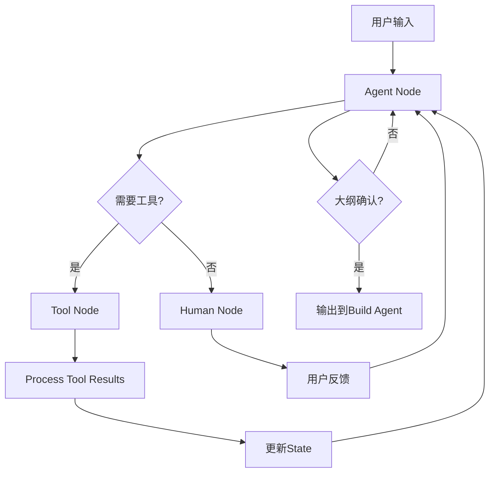
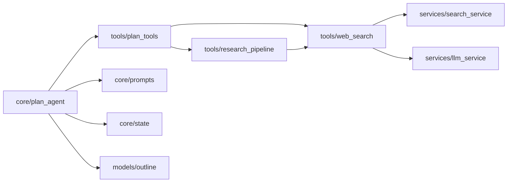

# PPT Outline Agent

## 📋 概述

PPT Outline Agent 是一个基于 **LangGraph ReAct 模式**的对话式PPT大纲生成系统，专门用于创建华为风格的高密度信息型演示文稿大纲。

## 🎯 核心功能

- **智能研究**: 支持网络搜索、深度研究、6步综合研究管道
- **对话式大纲生成**: 通过自然语言交互创建和修改PPT大纲
- **华为风格规范**: 遵循华为企业PPT设计标准（深红标题、高密度布局）
- **8种布局模式**: 支持从简单到复杂的8种视觉布局
- **MCP检索服务**: 集成智谱Web搜索MCP服务

## 📁 目录结构

```
ppt_outline_agent/
├── README.md                      # 本文档
├── config.py                      # 配置管理
├── core/                          # 核心逻辑层
│   ├── plan_agent.py             # Plan Agent主逻辑（LangGraph状态机）
│   ├── state.py                  # 状态定义（PlanState/BuildState）
│   └── prompts.py                # 系统提示词和风格指南
├── models/                        # 数据模型层
│   ├── outline.py                # 大纲数据模型（Pydantic）
│   └── __init__.py               # 模型初始化
├── tools/                         # 工具集
│   ├── plan_tools.py             # Plan工具集（create/modify/confirm）
│   ├── web_search.py             # 网络搜索工具
│   ├── deepseek_research.py      # 单次深度研究
│   └── research_pipeline.py      # 6步综合研究管道
└── services/                      # 服务层
    ├── search_service.py         # 统一检索服务（支持多提供商）
    └── llm_service.py            # LLM服务封装
```

## 🔄 核心工作流程

### 1. 用户交互 → 研究阶段
```
用户输入主题 → Agent询问研究深度 → 选择合适的研究工具
├── search_web: 简单网络搜索
├── research_topic: 单次深度研究
└── deep_research: 6步综合研究管道（推荐）
```

### 2. 大纲创建
```
LLM分析研究内容 → 调用create_outline() → _ensure_slide_density()增强密度
```

### 3. 用户反馈循环
```
展示大纲 → 用户反馈 → modify_outline() → 更新大纲 → 再次展示
```

### 4. 确认输出
```
用户满意 → confirm_outline() → state.outline_confirmed = True → 传递给Build Agent
```

## 🛠️ 关键组件说明

### 核心组件

#### `core/plan_agent.py`
- **作用**: LangGraph状态机核心
- **关键函数**:
  - `agent_node()`: LLM决策节点
  - `process_tool_results()`: 处理工具结果
  - `human_node()`: 用户交互节点
  - `build_plan_graph()`: 构建状态图

#### `core/state.py`
- **PlanState**: 对话状态管理
  - `outline`: 当前大纲
  - `outline_confirmed`: 确认标志
  - `phase`: 阶段标记

#### `core/prompts.py`
- **PLAN_SYSTEM_PROMPT**: 主系统提示词
- **PPT_FORMAT_GUIDE**: 8种布局规范
- **HUAWEI_STYLE_GUIDE**: 华为风格指南

### 工具集

#### `tools/plan_tools.py`
7个核心工具：
- `search_web`: 网络搜索
- `research_topic`: 单次深度研究  
- `deep_research`: 6步综合研究
- `create_outline`: 创建大纲
- `modify_outline`: 修改大纲
- `review_narrative`: 叙事审查
- `confirm_outline`: 确认大纲

#### `tools/research_pipeline.py`
6步研究管道：
1. 分析主题维度
2. 并行多查询搜索
3. 提取结构化洞见
4. 识别研究缺口
5. 针对性缺口填补
6. 综合生成报告

### 服务层

#### `services/search_service.py`
支持6种检索提供商：
- `zhipu_mcp`: 智谱Web搜索MCP（推荐）
- `tavily`: Tavily API
- `serpapi`: Google搜索
- `bing`: 免费爬取
- `baidu`: 百度爬取
- `bing+zhipu_pro`: 组合模式

#### `services/llm_service.py`
LLM统一封装：
- 连接池管理
- 自动降级
- 容错重试

## 🎨 8种布局模式

| layout_style | 视觉模式 | 目标元素 | 适用场景 |
|-------------|-----------|----------|----------|
| layout_1 | 左图右文英雄式 | 5-7 | 单一架构图+文字说明 |
| layout_2 | 问题-方案双栏 | 7-9 | 对比分析 |
| layout_3 | 三阶段垂直密集 | 10-13 | 综合情报简报 |
| layout_4 | 四象限网格 | 9-10 | 4类并行主题 |
| layout_5 | 区块混合 | 7-9 | 多架构+文本+表格 |
| layout_6 | 三栏分析 | 9-11 | 3角度分析 |
| layout_7 | 案例-流程-结论 | 9-12 | 案例驱动叙事 |
| layout_8 | 简单上下过渡 | 3-4 | 章节过渡 |

## 🔧 配置说明

### 环境变量（.env）
```bash
# LLM配置
CHAT_MODEL_BASE_URL=https://api.openai.com/v1
CHAT_MODEL_API_KEY=your-openai-key
CHAT_MODEL_NAME=gpt-4o

# 智谱MCP检索（推荐）
ZHIPU_MCP_URL=https://open.bigmodel.cn/api/paas/v4/web_search
ZHIPU_MCP_API_KEY=your-zhipu-key
SEARCH_API_PROVIDER=zhipu_mcp

# 图片生成
IMAGE_MODEL_BASE_URL=https://api.openai.com/v1
IMAGE_MODEL_API_KEY=your-openai-key
IMAGE_MODEL_NAME=dall-e-3

# 存储路径
IMAGE_CACHE_DIR=./storage/images
```

## 📊 数据流图



## 🎯 华为风格规范

### 设计原则
- **信息密度**: 空白区域 < 15%，营造紧凑专业感
- **配色方案**: 深红标题 (#8B0000) + 黑色正文
- **字体系统**: 全程微软雅黑，11-14pt
- **背景**: 纯白背景，禁止渐变和深色

### 标题格式强制
```
格式: "主题/维度：核心洞察+关键数据"
示例: "知识库存储洞察：统一数据底座，检索准确率95%"
```

### 元素分布目标
- 100% 内容页：subtitle + bullet_list
- ~50% 内容页：chart
- ~30% 内容页：table  
- ~40% 内容页：image/diagram
- ~20% 内容页：KPI（仅真实数据页）

## 🚀 使用示例

### 基础使用
```python
from core.plan_agent import build_plan_graph

# 构建状态图
graph = build_plan_graph()

# 初始状态
initial_state = {
    "messages": [{"role": "user", "content": "创建一个关于RAG技术的PPT大纲"}],
    "outline": None,
    "outline_confirmed": False,
    "phase": "planning"
}

# 执行流程
result = await graph.ainvoke(initial_state)
```

### 高级研究
```python
from tools.research_pipeline import deep_research_pipeline

# 6步综合研究
report = await deep_research_pipeline("RAG技术市场分析")
print(report)
```

## 🔍 依赖关系

### 外部依赖
- `langchain`: LLM框架
- `langgraph`: 状态图
- `httpx`: HTTP客户端
- `pydantic`: 数据验证
- `openai`: OpenAI客户端

### 内部依赖


## 🐛 故障排除

### 常见问题

1. **Import错误**
   - 确保`PYTHONPATH`包含`ppt_outline_agent`目录
   - 检查`__init__.py`文件存在

2. **检索服务失败**
   - 验证API密钥配置
   - 检查网络连接
   - 尝试备用提供商

3. **LLM调用超时**
   - 调整`max_tokens`和`temperature`
   - 检查API额度
   - 尝试备用端点

### 调试模式
```bash
export LOGLEVEL=DEBUG
python -m ppt_outline_agent.core.plan_agent
```

## 📈 性能优化

- **连接池**: 使用全局requests会话
- **并发搜索**: 多查询并行执行
- **缓存机制**: 图片检索结果缓存
- **降级策略**: 多级检索提供商备用

## 🤝 贡献指南

1. Fork项目
2. 创建功能分支
3. 遵循华为风格规范
4. 添加单元测试
5. 提交Pull Request

## 📄 许可证

MIT License - 详见LICENSE文件

---

**版本**: v1.0.0  
**最后更新**: 2026-03-03  
**作者**: AutoSlides Team